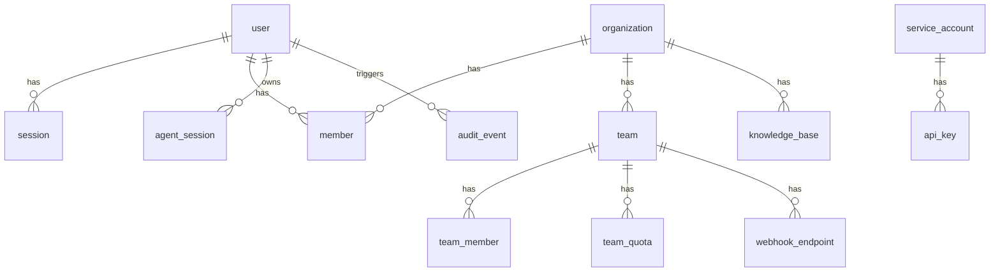

# Agent UI Architecture

## System Overview

Agent UI is a modern React application built with Next.js 16 that provides a chat interface for interacting with AgentOS instances. The architecture follows a unidirectional data flow pattern with centralized state management.

## Authentication Architecture

All routes require authentication except `/login` and `/api/auth/*`. The system uses SSO-first design with a fail-safe local admin account.

### Authentication Flow

```mermaid
┌─────────────────────────────────────────────────────────────────┐
│                        User Request                              │
└─────────────────────────────────────────────────────────────────┘
                              │
                              ▼
┌─────────────────────────────────────────────────────────────────┐
│                    Next.js Proxy (proxy.ts)                      │
│  • Check session via auth.api.getSession()                       │
│  • Public routes: /login, /api/auth/*                           │
│  • All other routes → redirect to /login?redirect={originalUrl} │
└─────────────────────────────────────────────────────────────────┘
                              │
              ┌───────────────┴───────────────┐
              ▼                               ▼
┌──────────────────────┐         ┌──────────────────────┐
│     /login Page      │         │   Protected Routes   │
│  ┌────────────────┐  │         │  /, /chat, /admin    │
│  │  SSO Buttons   │  │         │  /profile, /knowledge│
│  │  (dynamic)     │  │         └──────────────────────┘
│  └────────────────┘  │
│  [Admin login link]  │
│         ↓            │
│  ┌────────────────┐  │
│  │ Email/Password │  │
│  │  (admin only)  │  │
│  └────────────────┘  │
└──────────────────────┘
```

### Route Structure

| Route | Purpose | Auth Required |
|-------|---------|---------------|
| `/login` | SSO buttons + admin login | No |
| `/` | Dashboard (landing page) | Yes |
| `/chat` | Chat interface | Yes |
| `/admin` | Admin dashboard | Yes + Admin role |
| `/profile` | User profile | Yes |
| `/knowledge` | Knowledge base | Yes |
| `/api/auth/*` | Better Auth endpoints | No |

### Key Authentication Files

| File | Purpose |
|------|---------|
| `proxy.ts` | Route protection (Next.js 16 proxy) |
| `src/lib/auth.ts` | Better Auth server config |
| `src/lib/auth-client.ts` | Better Auth client |
| `src/lib/auth/seedAdmin.ts` | Fail-safe admin seeding |
| `src/components/auth/` | Login components |

### AgentOS JWT Authentication

Agent UI authenticates with AgentOS using RS256-signed JWTs. The token flow:

1. **User login** → Better Auth session established
2. **API request** → Client calls `/api/agentos/token` to get JWT
3. **Token signed** → Server validates session, signs JWT with private key
4. **Request sent** → Client adds `Authorization: Bearer <token>` header
5. **Token verified** → AgentOS validates JWT with public key

**Key Files:**

| File | Purpose |
|------|---------|
| `src/lib/agentos/jwt.ts` | JWT signing service (server-side) |
| `src/lib/agentos/tokenStore.ts` | In-memory token cache with auto-refresh |
| `src/lib/agentos/client.ts` | Authenticated API client |
| `src/lib/agentos/scopes.ts` | Role-to-scope mapping |
| `src/app/api/agentos/token/route.ts` | Token issuance endpoint |

**Token Lifecycle:**

- Tokens expire after 15 minutes (configurable via `AGENTOS_JWT_EXPIRES_IN`)
- Auto-refresh triggers when < 5 minutes remaining
- Tokens stored in memory only (cleared on page refresh)
- Logout clears cached token

See [AgentOS Authentication Guide](./AGENTOS_AUTH.md) for setup instructions.

## Architecture Diagram

```mermaid
┌─────────────────────────────────────────────────────────────────────────┐
│                           Agent UI Application                          │
├─────────────────────────────────────────────────────────────────────────┤
│                                                                         │
│  ┌─────────────────────────────────────────────────────────────────┐   │
│  │                         Next.js App Router                       │   │
│  │  ┌─────────────┐      ┌─────────────┐      ┌─────────────────┐   │   │
│  │  │  proxy.ts   │ ──── │  layout.tsx │ ──── │  Route Groups   │   │   │
│  │  │ (auth gate) │      │   (theme)   │      │ (main)/(enterprise)│  │   │
│  │  └─────────────┘      └─────────────┘      └────────┬────────┘   │   │
│  └────────────────────────────────────────────────────┼────────────┘   │
│                                                       │                 │
│  ┌────────────────────────────────────────────────────┼────────────┐   │
│  │                      Component Layer               │            │   │
│  │                                                    ▼            │   │
│  │  ┌──────────────────────┐    ┌──────────────────────────────┐  │   │
│  │  │       Sidebar        │    │          ChatArea            │  │   │
│  │  │  ┌────────────────┐  │    │  ┌────────────────────────┐  │  │   │
│  │  │  │ EntitySelector │  │    │  │     MessageArea        │  │  │   │
│  │  │  ├────────────────┤  │    │  │  ┌──────────────────┐  │  │  │   │
│  │  │  │  ModeSelector  │  │    │  │  │    Messages      │  │  │  │   │
│  │  │  ├────────────────┤  │    │  │  │  ┌────────────┐  │  │  │  │   │
│  │  │  │   AuthToken    │  │    │  │  │  │MessageItem │  │  │  │  │   │
│  │  │  ├────────────────┤  │    │  │  └──┴────────────┴──┘  │  │  │   │
│  │  │  │   Sessions     │  │    │  ├────────────────────────┤  │  │   │
│  │  │  │  ┌──────────┐  │  │    │  │      ChatInput         │  │  │   │
│  │  │  │  │SessionItem│ │  │    │  └────────────────────────┘  │  │   │
│  │  │  └──┴──────────┴──┘  │    └──────────────────────────────┘  │   │
│  │  └──────────────────────┘                                      │   │
│  └────────────────────────────────────────────────────────────────┘   │
│                                │                                       │
│  ┌─────────────────────────────┼───────────────────────────────────┐  │
│  │                    Hooks Layer                                   │  │
│  │                             │                                    │  │
│  │  ┌──────────────────┐  ┌────┴─────────────┐  ┌───────────────┐  │  │
│  │  │ useChatActions   │  │useAIResponseStream│  │useSessionLoader│ │  │
│  │  │ • initialize     │  │ • streamResponse  │  │ • loadSession │  │  │
│  │  │ • clearChat      │  └────────┬─────────┘  └───────────────┘  │  │
│  │  │ • addMessage     │           │                               │  │
│  │  │ • getAgents      │  ┌────────┴─────────┐                     │  │
│  │  │ • getTeams       │  │useAIStreamHandler│                     │  │
│  │  └──────────────────┘  │ • event routing  │                     │  │
│  │                        └──────────────────┘                     │  │
│  └─────────────────────────────┬───────────────────────────────────┘  │
│                                │                                       │
│  ┌─────────────────────────────┼───────────────────────────────────┐  │
│  │                    State Layer (Zustand)                        │  │
│  │                             │                                    │  │
│  │  ┌──────────────────────────┴───────────────────────────────┐   │  │
│  │  │                      useStore                             │   │  │
│  │  │  ┌─────────────┐  ┌─────────────┐  ┌─────────────────┐   │   │  │
│  │  │  │  Endpoint   │  │   Entity    │  │    Messages     │   │   │  │
│  │  │  │  • endpoint │  │  • agents   │  │   • messages    │   │   │  │
│  │  │  │  • active   │  │  • teams    │  │   • streaming   │   │   │  │
│  │  │  │  • loading  │  │  • mode     │  │   • error       │   │   │  │
│  │  │  └─────────────┘  └─────────────┘  └─────────────────┘   │   │  │
│  │  │  ┌─────────────┐  ┌─────────────┐  ┌─────────────────┐   │   │  │
│  │  │  │    Auth     │  │  Sessions   │  │      UI         │   │   │  │
│  │  │  │ • authToken │  │• sessionsData│ │ • chatInputRef  │   │   │  │
│  │  │  └─────────────┘  │• loading    │  │ • hydrated      │   │   │  │
│  │  │                   └─────────────┘  └─────────────────┘   │   │  │
│  │  └──────────────────────────────────────────────────────────┘   │  │
│  └─────────────────────────────────────────────────────────────────┘  │
│                                │                                       │
│  ┌─────────────────────────────┼───────────────────────────────────┐  │
│  │                      API Layer                                   │  │
│  │                             │                                    │  │
│  │  ┌──────────────────────────┴───────────────────────────────┐   │  │
│  │  │                    src/api/os.ts                          │   │  │
│  │  │  • getAgentsAPI      • getTeamsAPI      • getStatusAPI    │   │  │
│  │  │  • getAllSessionsAPI • getSessionAPI    • deleteSessionAPI│   │  │
│  │  └──────────────────────────────────────────────────────────┘   │  │
│  │                             │                                    │  │
│  │  ┌──────────────────────────┴───────────────────────────────┐   │  │
│  │  │                  src/api/routes.ts                        │   │  │
│  │  │  • GetAgents    • AgentRun     • Status                   │   │  │
│  │  │  • GetSessions  • GetSession   • DeleteSession            │   │  │
│  │  │  • GetTeams     • TeamRun      • DeleteTeamSession        │   │  │
│  │  └──────────────────────────────────────────────────────────┘   │  │
│  └─────────────────────────────────────────────────────────────────┘  │
│                                │                                       │
└────────────────────────────────┼───────────────────────────────────────┘
                                 │
                                 ▼
┌─────────────────────────────────────────────────────────────────────────┐
│                          AgentOS Backend                                │
│  ┌─────────────────┐  ┌─────────────────┐  ┌─────────────────────────┐ │
│  │  Agent Service  │  │  Team Service   │  │    Session Storage      │ │
│  └─────────────────┘  └─────────────────┘  └─────────────────────────┘ │
└─────────────────────────────────────────────────────────────────────────┘
```

## Data Flow

### 1. Initialization Flow

```tree
App Mount
    │
    ▼
useChatActions.initialize()
    │
    ├─► getStatusAPI() ─► Check endpoint health
    │
    ├─► getAgentsAPI() ─► Fetch available agents
    │
    ├─► getTeamsAPI() ─► Fetch available teams
    │
    └─► Update store with:
        • isEndpointActive
        • agents[]
        • teams[]
        • selectedModel
        • mode
```

### 2. Message Sending Flow

```tree
User types message
    │
    ▼
ChatInput.handleSubmit()
    │
    ├─► addMessage(userMessage)     ─► Store: messages[]
    │
    ├─► setIsStreaming(true)        ─► Store: isStreaming
    │
    ▼
useAIResponseStream.streamResponse()
    │
    ├─► POST /agents/{id}/runs (SSE)
    │
    ▼
Stream Events Loop
    │
    ├─► RunContent ────► Append to response message
    │
    ├─► ToolCallStarted ─► Add tool call to message
    │
    ├─► ToolCallCompleted ─► Update tool call result
    │
    ├─► ReasoningStep ─► Update reasoning display
    │
    └─► RunCompleted ──► setIsStreaming(false)
```

### 3. Session Management Flow

```mermaid
User selects session
    │
    ▼
useSessionLoader.loadSession()
    │
    ├─► getSessionAPI(sessionId)
    │
    ▼
Parse response into ChatMessage[]
    │
    └─► setMessages(messages)
```

## Component Architecture

### UI Component Hierarchy

```tree
<LoginPage>                        // /login route
├── <SSOButtons>                   // Dynamic SSO provider buttons
└── <AdminLoginForm>               // Email/password (hidden default)

<Dashboard>                        // / route (landing page)
├── <Tabs>                         // Overview | Admin (role-based)
├── <UsageStats>                   // Usage metrics
├── <QuickActions>                 // New chat, settings links
├── <PinnedAgents>                 // Favorite agents grid
├── <RecentSessions>               // Session history
├── <TeamActivityFeed>             // Activity stream
└── <AdminMetrics>                 // Admin-only tab

<Sidebar>
├── <EntitySelector>     // Agent/Team dropdown
│   └── <Select>
├── <ModeSelector>       // Agent vs Team toggle
│   └── <Select>
├── <AuthToken>          // API token input
│   └── <Dialog>
├── <NewChatButton>      // Clear chat action
│   └── <Button>
└── <Sessions>           // Session list
    └── <SessionItem>*   // Individual session
        └── <DeleteSessionModal>

<ChatArea>
├── <MessageArea>
│   └── <Messages>
│       ├── <ChatBlankState>       // Empty state
│       ├── <AgentThinkingLoader>  // Loading indicator
│       └── <MessageItem>*         // Individual message
│           ├── <MarkdownRenderer> // Content display
│           ├── <ToolCall>         // Tool call display
│           ├── <Images>           // Image gallery
│           ├── <Videos>           // Video player
│           └── <Audios>           // Audio player
├── <ScrollToBottom>               // Auto-scroll button
└── <ChatInput>                    // Message input
    └── <Textarea>
```

### UI Primitives (shadcn/ui)

```tree
components/ui/
├── button.tsx      // Variant-based buttons
├── card.tsx        // Card containers
├── dialog.tsx      // Modal dialogs
├── input.tsx       // Text inputs
├── label.tsx       // Form labels
├── select.tsx      // Dropdown selects
├── skeleton.tsx    // Loading placeholders
├── tabs.tsx        // Tab navigation
├── textarea.tsx    // Text input areas
├── sonner.tsx      // Toast notifications
├── icon/           // Custom icon system
│   ├── Icon.tsx
│   ├── constants.tsx
│   └── custom-icons.tsx
├── tooltip/        // Hover tooltips
│   └── tooltip.tsx
└── typography/     // Text components
    ├── Heading/
    ├── Paragraph/
    └── MarkdownRenderer/

components/auth/     // Authentication components
├── LoginPage.tsx    // Main login UI
├── SSOButtons.tsx   // Dynamic SSO buttons
├── AdminLoginForm.tsx // Email/password form
└── index.ts

components/dashboard/ // Dashboard widgets
├── Dashboard.tsx    // Container with tabs
├── UsageStats.tsx   // Usage metrics
├── QuickActions.tsx // Action buttons
├── PinnedAgents.tsx // Agent favorites
├── RecentSessions.tsx // Session list
├── TeamActivityFeed.tsx // Activity stream
├── AdminMetrics.tsx // Admin-only metrics
└── index.ts
```

## State Management

### Zustand Store Structure

```typescript
interface Store {
  // Hydration
  hydrated: boolean
  setHydrated: () => void

  // Endpoint
  endpoints: Endpoint[]
  setEndpoints: (endpoints: Endpoint[]) => void
  selectedEndpoint: string
  setSelectedEndpoint: (endpoint: string) => void
  isEndpointActive: boolean
  setIsEndpointActive: (active: boolean) => void
  isEndpointLoading: boolean
  setIsEndpointLoading: (loading: boolean) => void

  // Authentication
  authToken: string
  setAuthToken: (token: string) => void

  // Entities
  agents: AgentDetails[]
  setAgents: (agents: AgentDetails[]) => void
  teams: TeamDetails[]
  setTeams: (teams: TeamDetails[]) => void
  mode: 'agent' | 'team'
  setMode: (mode: 'agent' | 'team') => void
  selectedModel: string
  setSelectedModel: (model: string) => void

  // Messages
  messages: ChatMessage[]
  setMessages: (messages: ChatMessage[] | UpdateFn) => void
  isStreaming: boolean
  setIsStreaming: (streaming: boolean) => void
  streamingErrorMessage: string
  setStreamingErrorMessage: (error: string) => void

  // Sessions
  sessionsData: SessionEntry[] | null
  setSessionsData: (sessions: SessionEntry[] | UpdateFn) => void
  isSessionsLoading: boolean
  setIsSessionsLoading: (loading: boolean) => void

  // UI
  chatInputRef: React.RefObject<HTMLTextAreaElement>
}
```

### Persistence

The store uses `zustand/middleware` persist with localStorage:

```typescript
persist(
  (set) => ({ /* store implementation */ }),
  {
    name: 'agent-ui-storage',
    storage: createJSONStorage(() => localStorage),
    partialize: (state) => ({
      endpoints: state.endpoints,
      selectedEndpoint: state.selectedEndpoint,
      authToken: state.authToken
    }),
    onRehydrateStorage: () => (state) => {
      state?.setHydrated()
    }
  }
)
```

## URL State Management

Query parameters managed with `nuqs`:

| Parameter | Purpose |
|-----------|---------|
| `agent` | Selected agent ID |
| `team` | Selected team ID |
| `session` | Current session ID |
| `db_id` | Database identifier |

## Styling Architecture

### Tailwind CSS Configuration

```typescript
// tailwind.config.ts
{
  darkMode: 'class',
  theme: {
    extend: {
      colors: {
        background: 'hsl(var(--background))',
        foreground: 'hsl(var(--foreground))',
        // ... semantic colors
      },
      animation: {
        'fade-in': 'fadeIn 0.5s ease-out',
        // ... custom animations
      }
    }
  }
}
```

### CSS Variables (Dark Mode)

```css
:root {
  --background: 0 0% 100%;
  --foreground: 222.2 84% 4.9%;
  /* ... */
}

.dark {
  --background: 222.2 84% 4.9%;
  --foreground: 210 40% 98%;
  /* ... */
}
```

### Utility Function

```typescript
// cn() - Conditional class merging
import { cn } from '@/lib/utils'

cn('base-class', isActive && 'active-class', className)
```

## Performance Considerations

### 1. Streaming Optimization

- Uses native `ReadableStream` for SSE
- Buffered parsing prevents incomplete JSON errors
- Event-driven updates minimize re-renders

### 2. State Selectors

```typescript
// Good: Selective subscription
const agents = useStore((state) => state.agents)

// Avoid: Full store subscription
const store = useStore()
```

### 3. Component Memoization

- Message items memoized for large conversations
- Expensive computations use `useMemo`

### 4. Lazy Loading

- Next.js automatic code splitting
- Dynamic imports for heavy components

## Security

### Authentication

**User Authentication (Better Auth):**

- SSO-first design with OIDC/SAML providers
- Fail-safe local admin account (env-configured)
- Session-based auth with cookie management
- Role-based access control (user → globalAdmin)

**AgentOS Authentication:**

- Bearer token auth via `Authorization` header
- Token stored in localStorage (configurable)
- Environment variable fallback: `NEXT_PUBLIC_OS_SECURITY_KEY`

### Content Security

- Markdown sanitized with `rehype-sanitize`
- XSS prevention in rendered content
- No direct HTML injection

## Deployment Architecture

```mermaid
┌─────────────────┐     ┌─────────────────┐     ┌─────────────────┐
│  Static Assets  │     │   Next.js App   │     │    AgentOS      │
│   (Vercel/CDN)  │ ──► │   (SSR/Client)  │ ──► │    Backend      │
└─────────────────┘     └─────────────────┘     └─────────────────┘
         │                       │                       │
         │                       │                       │
         ▼                       ▼                       ▼
    CSS/JS/Images          React Hydration       REST API + SSE
```

## Database Architecture

Agent UI uses PostgreSQL with Drizzle ORM for enterprise features.

### Schema Overview



### Key Tables

| Table | Purpose |
|-------|---------|
| `user` | User accounts with SSO profile attributes |
| `session` | Authentication sessions (Better Auth) |
| `organization` | Multi-tenant organizations with hierarchy |
| `team` | Teams within organizations |
| `member` | Organization membership with roles |
| `agent_session` | Chat session history with visibility controls |
| `audit_event` | Compliance audit trail |
| `knowledge_base` | Scoped knowledge bases |
| `webhook_endpoint` | Integration webhooks |
| `service_account` | API access for integrations |

### Database Initialization

The schema is managed by Drizzle ORM. Tables are created via:

- **Development:** `mise db:push` (direct schema sync)
- **Docker:** `db-init` container (runs before app startup)
- **Kubernetes:** Pre-install Helm hook job

See `src/lib/db/schema.ts` for full schema definitions.

## Future Considerations

1. **WebSocket Support** - Alternative to SSE for bidirectional communication
2. **Offline Support** - Service worker for offline-first capability
3. **Multi-tenant** - Support multiple AgentOS instances simultaneously
4. **Plugin System** - Extensible message renderers and actions
